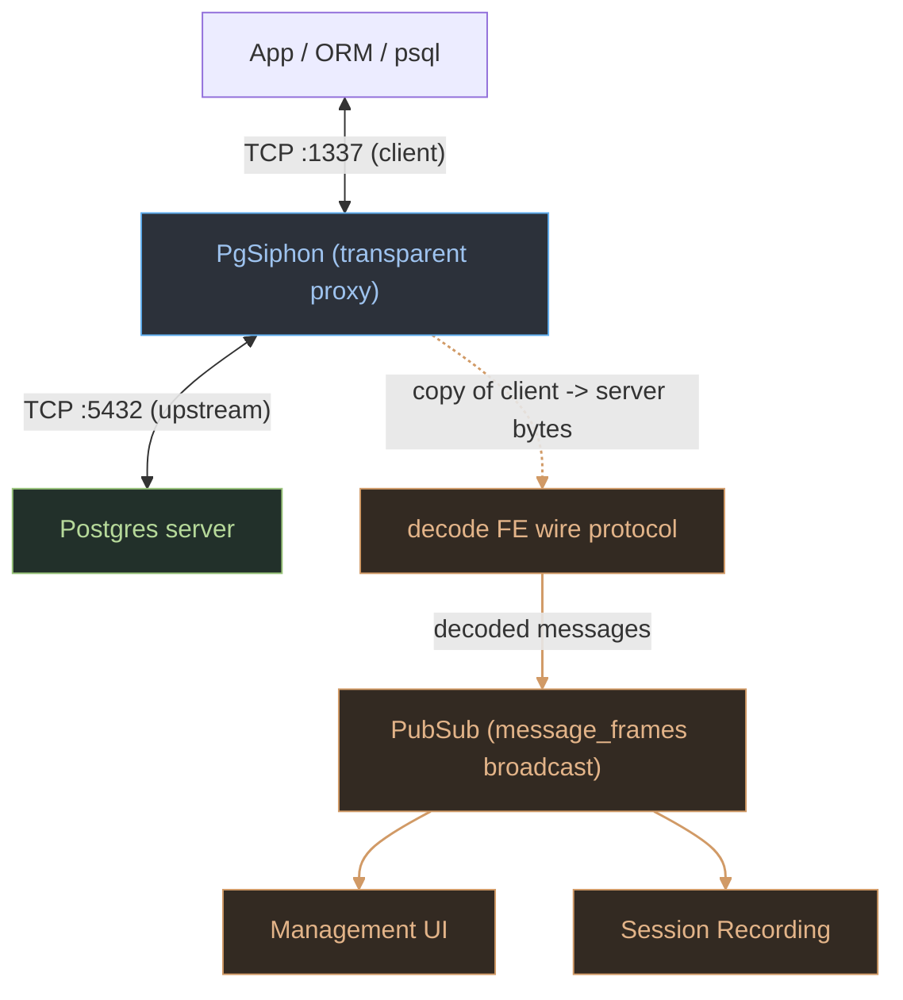

Do you sometimes feel like your ORM is hiding SQL activity from you? Have you ever not really
understood how your often your app is sending off database queries? Or, have you ever wanted
to do a huge performance refactor and need the ability to prove that your changes are actually
improving performance?

If you've answered yes to this, you likely did one of the following:

1. Turn up the sql logging level in your application to trace and log all the queries (enjoy that)
2. Use a packet sniffer like Wireshark to capture the traffic (enjoy that) to look at later
3. Look at something like `pg_stat_statements` to see what queries are being executed

If you are like me, you probably tried these approaches with mixed success, and decided
'well it *feels* faster' and moved on.

But, what if you could see exactly what your application is sending to Postgres, in real time,
and have the ability to log and analyse that traffic later, or just save it for posterity?
...well, there is probably an existing tool that can do this but I chose to write my own drop-in
proxy to do exactly this.

[`pg_siphon`](https://github.com/williamthom-as/pg_siphon_management) is a simple TCP
(man-in-the-middle) proxy that sits between your application and
Postgres database, both forwarding every byte untouched, and observing the frontend/backend wire
protocol to surface/record all activity. There are no install scripts, just boot the proxy, change
your application  configuration to point at the proxy, and sit back and watch the queries fly past.

This gives us several advantages over the other approaches mentioned above:

1. We know exactly what is being sent to Postgres.
2. We know exactly when it is being sent to Postgres.
3. We know exactly when queries are issued and at what rate
4. We can store all of this later for analysis, comparison, or just for posterity.

I'll spend a brief amount of this article talking about the tehcnical implementation, how it works,
how to use it, and finish off running you through a few examples of how  I've used it in the past
for troubleshooting and performance analysis.

### Technical Background

Here's a rough overview of how it looks:



Data streaming into the proxy is immediately forarded to the Postgres server, which allows for very little
overhead to performance when we put it infront of the app. We also take a copy of the stream of activity
on a sidecar process, which decodes the Postgres wire protocol (FE) and publishes it to a pub/sub system for
either the UI or recording process to consume.

This entire process is written entirely in Elixir, the proxy uses `:gen_tcp`, and the decoding of the wire
protocol is done entirely using a custom parser written in Elixir. At the moment, and likely forever, you
will need to disable SSL on your pg server, as we don't support SSL termination or passthru in the proxy
(use `sslmode=disable` in your connection string, or `trust` in `pg_hba.conf`).

#### Parsing messages (and a quick primer on the Postgres wire protocol)

Postgres uses a simple, length prefixed binary message protocol over a single TCP connection. You can read
all about it here [Postgres: Chapter 54. Frontend/Backend Protocol](https://www.postgresql.org/docs/current/protocol.html).

What it really means for us is that (generally speaking) we can read the first byte of a message to determine the type of message, then read the next 4 bytes to determine the length of the payload, and then read the rest of the message based.

**Regular message framing:**

```
+--------+------------------+---------------------------+
| type   | length (Int32)   | payload                   |
| 1 byte | 4 bytes, BE      | (length - 4) bytes        |
+--------+------------------+---------------------------+
```

Those that have used Elixir before will know that it has a very powerful pattern matching system, as well as
guard clauses, recursion and byte matching. This makes parsing the Postgres wire protocol probably as easy as
it can be in any language.

Lets look at a trivial example of how messages are sent over the wire. Lets take a simple query, say `SELECT * FROM names;` 
and follow it through its journey over the wire protocol, and see how it is parsed in Elixir.

```bash
# sending "SELECT * FROM names;"

<<50 00 00 00 1C 00 53 45 4C 45 43 54 20 2A 20 46 52 4F 4D 20
  6E 61 6D 65 73 3B 00 00 00 44 00 00 00 06 53 00 48 00 00 00 04>>
```

We've just received this, lets deconstruct it into the three individual messages (`Parse (P)`, `Describe (D)`, `Flush (H)`)
that Postgres will send.

```
50 00 00 00 1C 00 53 45 4C 45 43 54 20 2A 20 46 52 4F 4D 20 6E 61 6D 65 73 3B 00 00 00   <- P, len 0x1C = 28
44 00 00 00 06 53 00                                                                     <- D, len 6
48 00 00 00 04                                                                           <- H, len 4
```

| segment          | bytes | meaning                                                |
  |------------------|-------|--------------------------------------------------------|
  | `50`             | 1     | type `P`                                               |
  | `00 00 00 1C`    | 4     | length 28 (covers length + payload, not the type byte) |
  | `00`             | 1     | empty prepared statement name (null term)              |
  | `53…3B`          | 20    | `"SELECT * FROM names;"`                                |
  | `00`             | 1     | query string null terminator                           |
  | `00 00`          | 2     | Int16 parameter count = 0                              |
  | `44 00 00 00 06` | 5     | `D`, length 6                                          |
  | `53 00`          | 2     | describe target `S` (Statement)                      |
  | `48 00 00 00 04` | 5     | `H` (Flush) (no body)                                  |


#### Processing in Elixir

The full implementation can be found here [message.ex](https://github.com/williamthom-as/pg_siphon/blob/main/lib/pg_siphon/message.ex),
if you want to follow along.

```elixir
# Invoked via PgSiphon.Message.decode(<<80, 0, 0, 0, 28, ...>>)

# 80 = "P" (Parse): the first message in our frame
def decode(<<80, length::integer-size(32), rest::binary>>) when length - 4 <= byte_size(rest) do
  <<message::binary-size(length - 4), rest::binary>> = rest

  # P carries a prepared statement name, so split the payload on the first null byte
  {prepared_statement, content} = bin_split(message)

  prepared_statement =
    case prepared_statement do
      "" -> []
      _ -> :binary.bin_to_list(prepared_statement)
    end

  [
    %PgSiphon.Message{
      payload: content,
      type: "P",
      length: length,
      extras: %{prepared_statement: prepared_statement}
    }
    | decode(rest)
  ]
end

# ....

# 72 = "H" (Flush): most types share this identical generic shape
def decode(<<72, length::integer-size(32), rest::binary>>) when length - 4 <= byte_size(rest) do
  <<message::binary-size(length - 4), rest::binary>> = rest

  [%PgSiphon.Message{payload: message, type: "H", length: length} | decode(rest)]
end
```

The process follows a simple pattern:

1. We pattern match against the first byte of the message
2. We pattern match against the next 4 bytes to get the length of the message
3. We then pattern match against the rest of the message, using the length to extract the payload
4. We store the decoded message in the list, and pass off the remaining bytes to the next invocation of `decode/1`
to repeat the process until we have no more bytes left.

Most message types share that exact skeleton (like the `H` clause above) but a few do a little extra impl specific
work. For example, in the payload `P`, the prepared-statement name is extracted first before storing the rest.

The message is then broadcast to the pub/sub system, which is then consumed by the management ui or recording process.

### Installation

I'd suggest using Docker, if you don't want to build it yourself. Otherwise, you can build it
yourself just follow the instructions in the README.md

```bash
docker build -t pg_siphon .
```

Run
```bash
docker run -p 4004:4004 -p 5432:5432 -p 1337:1337 -e SECRET_KEY_BASE=$(mix phx.gen.secret) -e PORT=4004 pg_siphon
```

Make sure if psql is running locally to use `--add-host=host.docker.internal:host-gateway`.

You may also want to host the recordings/analysis directory outside of the container. To do
this, you can mount a volume to the container. For example, to mount the current directory
to the container, you can add `-v <my_local_dir>:/etc/pg_siphon_management` to the
`docker run` command.

and configure prod.exs as:

```elixir
config :pg_siphon, :proxy_server,
  to_host: ~c"host.docker.internal",
  to_port: 5432, # change if needed, postgres will use this
  from_port: 1337 # change if needed, your app will use this
```

### Tour/Capabilities

[`pg_siphon`](https://github.com/williamthom-as/pg_siphon_management) is made up of two parts, the proxy server and the management ui, for the most part
this article is focused on the management ui, but you can actually run it headless if you wanted
to, it has all the capabilities of recording, analysing and viewing traffic without the ui overhead.

For the purposes of screenshots and examples, I will be using the management ui hooked up to a Huginn
Rails application.

#### Live Activity View


Firstly, when you boot the management ui, you are presented with the live view of the traffic, broken
down by Postgres message type. You are seeing Postgres frontend messages in this view, including types like
`Query`, `Parse`, `Bind`, `Execute` and `Close`. You can read more about it here:
[Postgres Protocol Message Formats](https://www.postgresql.org/docs/current/protocol-message-formats.html).


#### Filtering and Pausing

You can filter specific message types using the filter selection boxes on the left, which allows you to
focus on the specific messages you are interested in. These also carry over to the recording view, if
you have filtered out a message type duing recording, it will not be present in the recording analysis
views.

If you are getting overwhelmed by the amount of traffic, you can also pause the live view, which will
continue the recording (if enabled), but stop the live view from updating. Once resumed, the view
will continue to show live activity, not replay the missed traffic from before pausing.

#### Recording Activity


`Record Session` in the accordion allows you to start and end recording a sessions.
They are recorded in binary format. Its closest to a csv, but don't let the ui fool you,
it isnt a CSV, and the other targets don't actually exist. PRs welcome.

Once you start recording, it is quite obvious:


#### Analysis

Once you have recorded a session, you can view the analysis of that session by clicking on the
`Analysis` link in the side navbar.

From here, you can view your Postgres traffic:


It is pretty straight forward, you can filter message types, tables, statement types, or search
for specific keywords in queries. Some generic information around counts and times is also avaialble.

#### Workflows

In my experience, I tend to boot it up and run my development connections thru it, even if I am not
actively monitoring it. When you are debugging, it is helpful to have the live view open, just to get a
feel for the traffic frequency and volume of your application, I promise you will be suprised at what you
see.

Additionally, the next time you are conducting some database performance tuning, whether it be refactoring for batched
requests, bulk operations or improving your application's caching, give recording a session before and after
a go. I find it immensely rewarding to see thousands of DDL statements be optimised down to single digits,
or enjoy the satisfaction of finding long running queries and making them more efficient.

When recording a session, it can be helpful to use breakpoints to capture specific traffic. If not, another
tool I have used in the past is to fire a comment, for example;

`ActiveRecord::Base.connection.execute("-- start trace")`

which will be sent as a simple query, so monitor for `Q` messages in the active view.

### Conclusions

[`pg_siphon`](https://github.com/williamthom-as/pg_siphon_management) is pretty conceptually simple, but has actually
saved me a lot of time in both troubleshooting and performance analysis in a way other tools have not been able to. I hope you
find it useful too, in solving some obscure problem, and if you have any feedback, please feel free
to raise them at [GitHub repo](http://github.com/williamthom-as/pg_siphon_management/issues).

Visit:
- [`pg_siphon_management` Github](https://github.com/williamthom-as/pg_siphon_management)
- [`pg_siphon (proxy)` Github](https://github.com/williamthom-as/pg_siphon)